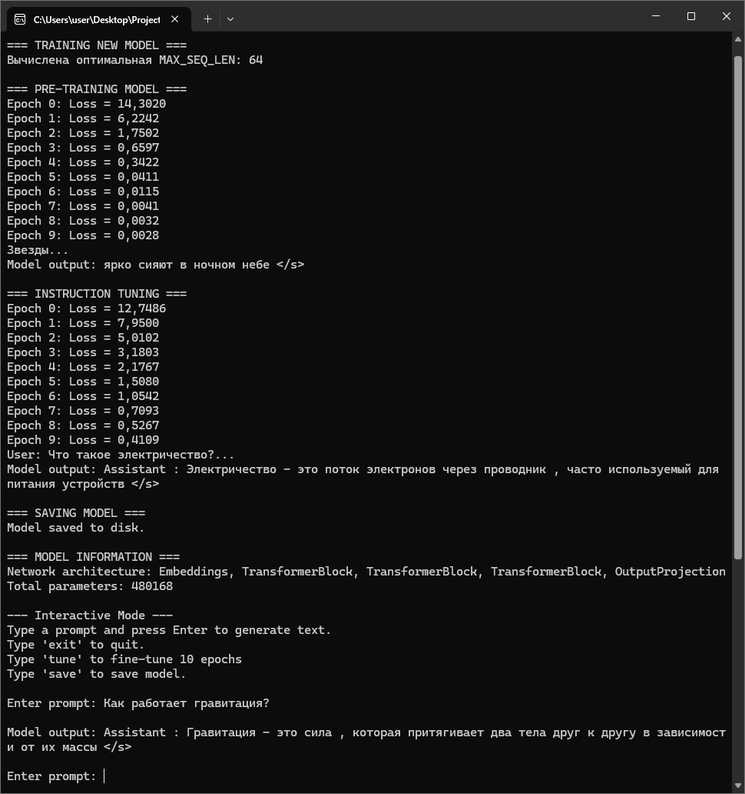

# MathNetGPT

Данный проект - перенос проекта https://github.com/tekaratzas/RustGPT на C#, для реализации нейросети типа LLM (Large Language Model) с нуля.

Проект демонстрирует архитектуру Transformer, процессы предварительного обучения (Pre-training) и дообучения (Instruction Tuning), а также интерактивный режим генерации текста.

Все вычисления (обучение) производятся через библиотеку MathNet: https://numerics.mathdotnet.com/

## 🚀 Возможности

*   **Архитектура Transformer:** Полная реализация блоков Self-Attention, FeedForward и LayerNorm.
*   **Обучение с нуля:** Возможность обучения модели на собственных данных (JSON формат).
*   **Два этапа обучения:**
    1.  *Pre-training:* Базовое обучение языку.
    2.  *Instruction Tuning:* Дообучение для выполнения инструкций и ответов в формате диалога.
*   **Интерактивный режим:** Возможность общения с моделью, сохранения состояния и дообучения прямо во время работы программы.
*   **Оптимизация:** Использование алгоритма Adam для оптимизации весов.

## 🛠 Технологии

Проект использует следующие библиотеки:
*   **.NET 9.0**: Основная платформа выполнения.
*   **MathNet.Numerics**: Для матричных вычислений и линейной алгебры.
*   **MessagePack**: Для сериализации/десериализации модели (бинарный формат).
*   **Newtonsoft.Json**: Для работы с JSON данными обучения.

## 📂 Структура проекта (`src`)

| Файл | Описание |
| :--- | :--- |
| `Llm.cs` | Основной класс модели, управляющий процессом обучения и предсказания |
| `Transformer.cs` | Реализация блока Transformer |
| `SelfAttention.cs` | Механизм Self-Attention (внимание к себе) |
| `FeedForward.cs` | Полносвязный слой нейросети |
| `LayerNorm.cs` | Нормализация слоя |
| `Adam.cs` | Оптимизатор Adam |
| `Tokenizer.cs` / `Vocab.cs` | Токенизация текста и управление словарем |
| `DatasetLoader.cs` | Загрузка и обработка обучающих данных |
| `data` | Корпус на русском языке |
| `data_en` | Корпус на английском языке |

## 📋 Требования

*   Windows, Linux или macOS с установленным **.NET 9 SDK**.
*   Наличие файлов данных:
    *   `data/pretrain.json` (данные для предварительного обучения).
    *   `data/tune.json` (данные для дообучения/инструкций).

## 🏃‍♂️ Как запустить

1.  Убедитесь, что у вас установлен .NET 9 SDK.
2.  Запустите проект:
    ```bash
    dotnet run
    ```

## 💡 Использование

При первом запуске программа автоматически обучит новую модель (это может занять время). При последующих запусках она загрузит сохраненную модель из файла `llm_model.bin`.

### Интерактивная консоль

После загрузки/обучения вы попадете в интерактивный режим. Доступные команды:
*   **`tune`**: Дообучить модель на 10 эпохах.
*   **`save`**: Сохранить текущее состояние модели в файл.
*   **`exit`**: Завершить работу программы.

Для проверки можно использовать примеры из корпуса (подпапка "data\tune.json"):
- Что вызывает дождь?
- Как формируются горы?
- Что такое тропические леса Амазонки?

и т.д.



## 📄 Лицензия

MIT
